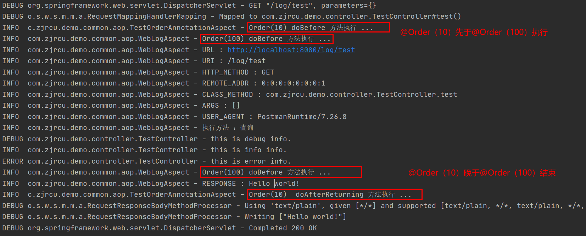

# log
日志框架学习与使用
### 一. 横切面中切点表达式的使用
1.1 由于Spring切面粒度最小是达到方法级别，
而execution表达式可以用于明确指定方法返回类型，类名，方法名和参数名等与方法相关的部件，
并且在Spring中，大部分需要使用AOP的业务场景也只需要达到方法级别即可，
因而execution表达式的使用是最为广泛的。如下是execution表达式的语法：
```java
execution(modifiers-pattern? ret-type-pattern declaring-type-pattern?name-pattern(param-pattern) throws-pattern?)
```
这里问号表示当前项可以有也可以没有，其中各项的语义如下：

* modifiers-pattern：方法的可见性，如public，protected；
* ret-type-pattern：方法的返回值类型，如int，void等；
* declaring-type-pattern：方法所在类的全路径名，如com.zjrcu.demo.controller；
* name-pattern：方法名类型，如TestController()；
* param-pattern：方法的参数类型，如java.lang.String；
* throws-pattern：方法抛出的异常类型，如java.lang.Exception；
 如下是一个使用execution表达式的例子：
 ```java
execution(public * com.zjrcu.demo.controller.*.*(..))
 ```
上述切点表达式将会匹配使用public修饰，返回值为任意类型，并且是com.zjrcu.demo.controller包中，任意控制器类中的任意方法，方法可以有任意个参数。
上述示例中我们使用了..通配符和*通配符，关于通配符的类型，主要有两种：

* *通配符，该通配符主要用于匹配单个单词，或者是以某个词为前缀或后缀的单词。

 如下示例表示返回值为任意类型，在com.zjrcu.demo.controller.TestController类中，并且参数个数为零的方法：
```java
execution(* com.zjrcu.demo.controller.TestController.*())
```
 下述示例表示返回值为任意类型，在com.zjrcu.demo.controller包中，以Test为前缀的类，并且是类中参数个数为零方法：
```java
execution(* com.zjrcu.demo.controller.Test*.*())
```
* ..通配符，该通配符表示0个或多个项，主要用于declaring-type-pattern和param-pattern中，
如果用于declaring-type-pattern中，则表示匹配当前包及其子包，如果用于param-pattern中，则表示匹配0个或多个参数。
如下示例表示匹配返回值为任意类型，并且是com.zjrcu.demo.controller包下的任意类的任意方法，
而且该方法可以有任意参数：
```java
execution(* com.zjrcu.demo.controller.*.*(..))
```
如下示例第一个..先表示com.zjrcu.demo包和其任意子包，第二个..表示任意个数的参数的示例，需要注意，表示参数的时候可以在括号中事先指定某些类型的参数，而其余的参数则由..进行匹配：
```java
execution(* com.zjrcu.demo..*.*(java.lang.String,..))
```
### 二、使用不同的@Order测试执行顺序
* 下面使用 @Order(10) 执行的代码片段
```java
@Aspect
@Component
@Order(10)
public class TestOrderAnnotationAspect {

    private final static Logger logger = LoggerFactory.getLogger(TestOrderAnnotationAspect.class);
    
    /**
     * 横切点
     */
    @Pointcut("execution(public * com.zjrcu.demo.controller.*.*(..))")
    public void orderLog(){}

    /**
     * 横切点方法执行之前执行
     * @param joinPoint
     */
    @Before(value = "orderLog()")
    public void doBefore(JoinPoint joinPoint){
        logger.info("Order(10) doBefore 方法执行 ...");
    }
}
```
* 下面使用 @Order(100) 执行的代码片段
```java
/**
 * web 访问切面
 */
@Aspect
@Component
@Order(100)
public class WebLogAspect {

    private final static Logger logger = LoggerFactory.getLogger(WebLogAspect.class);

    private ThreadLocal<Map<String, Object>> threadLocal  = new ThreadLocal<>();


    /**
     * 横切点
     */
    @Pointcut("execution(* com.zjrcu.demo..*.*(..))")
    public void webLog(){}

    @Before(value = "webLog()&& @annotation(controllerWebLog)")
    public void doBefore(JoinPoint joinPoint,ControllerWebLog controllerWebLog) {

        logger.info("Order(100) doBefore 方法执行 ...");
```
* 执行结果
